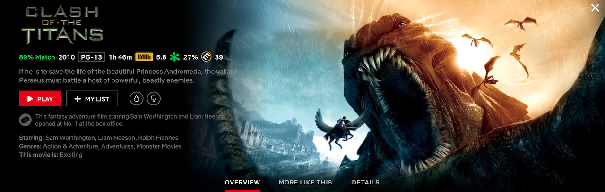
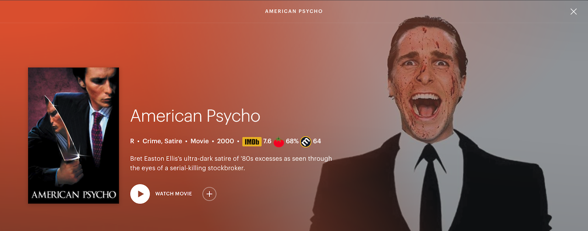
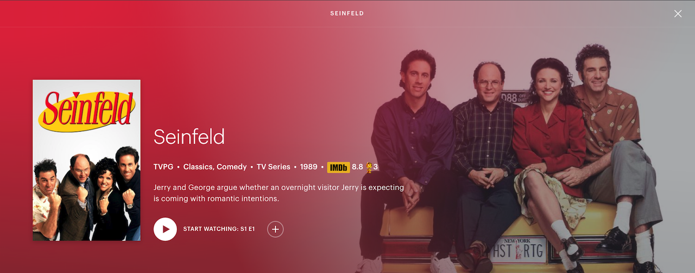

# Design

The Streaming Wizard adds movie and TV series ratings from IMDB, Rotten Tomatoes, and Metacritic, along with Oscars and Golden Globe awards, to titles on Netflix and Hulu. It utilizes the Open Movie Database API to get ratings data. 

With this lightweight extension, you will never again have to browse Netflix or Hulu while simultaneously searching for ratings on the side. The cumbersome days of finding something good to watch and avoiding all the crap are over.

## Functionality

The extension adds ratings and awards when users click on title details. Links to the IMDB and Rotten Tomatoes web pages for titles are also attached to the ratings.

Per Rotten Tomatoes, titles below 60% are rotten, titles between 60% and 75% are fresh, and titles above 75% with enough critic ratings are certified fresh. If Oscars and Golden Globe awards apply, these are appended as well. Examples below.

## Content and Background Scripts

1. The extension includes two content scripts for each Netflix and Hulu. Both content scripts listen to DOM changes when users click on title details. This triggers the getRatings function and its callback function, addRatings.

2. Each content script observes changes to the jawBone node and Masthead node on Netflix and Hulu browsing pages, respectively. The scripts call getRatings and addRatings when these nodes change, which occurs when users click on title details. 

3. Each content script observes changes to the bob-container node and hub-container node on Netflix and Hulu browsing pages, respectively. The scripts call getRatings and addRatings when these nodes change, which occurs when users hover over title details. Currently, this functionality isn't working. Will need to look into these elements that appear when users hover over titles.

4. The background script listens to internal navigations on Netflix and Hulu and executes the content scripts when the URLs change.

## Ratings

1. The getRatings function uses jQuery.ajax to query the OMDB API and return ratings to the callback function, which is the addRatings function.

2. The addRatings function creates elements for the rating logos, links to the official ratings pages (IMDB and Metacritic only ATM), and the ratings themselves. At the moment, the OMDB API does not provide Rotten Tomatoes and Metacritic data for TV series.

